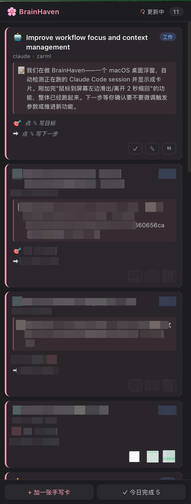

# BrainHaven 🌸

> 一个**桌面常驻、边缘自动隐藏**的小窗，帮你看见正在跑的所有 AI agent 会话。
>
> A macOS edge-hide widget that surfaces every running AI coding-agent session (Claude Code / Codex / Aider / Gemini / OpenCode) and lets you see at a glance what each session is doing.

<p align="center">
  
</p>

---

## 是什么 / Why

跑了好几个 Claude Code 窗口在不同项目里，过 5 分钟就忘了每个窗口在干什么。BrainHaven 自动扫描所有正在跑的 AI agent，**每个 session 一张卡片**，标题是这个会话的 aiTitle（Claude Code 自动起的主题名），描述是 away_summary（你 idle 后 Claude 主动生成的 recap）。

像 [`abtop`](https://github.com/graykode/abtop) 但更轻：不是 TUI 仪表盘，是一个**桌面边缘自动隐藏的浮窗**——平时藏起来不打扰，鼠标贴到屏幕左边就滑出来。

---

## 特点

- 🤖 **自动检测** 当前正在跑的 `claude` / `codex` / `aider` / `gemini` / `opencode` 进程，每 10 秒一次
- 📝 **抓取 recap** 从 Claude Code 的 JSONL transcript 里抠出 `aiTitle` 当卡片标题、`away_summary` 当描述
- 🌊 **边缘自动隐藏**（macOS Dock 式行为）——平时藏在屏幕外，鼠标到最左边触发滑出
- ✏️ **每张卡可填**「目标 + 下一步」帮你做"context check"
- ✓ **`/bh-done` slash command** 一键归档当前会话的卡片
- 🎯 **点击卡片自动切到对应终端 tab**（支持 iTerm2 / Terminal.app）——不用手动找哪个窗口
- 📊 **项目进度条**：cwd 根目录有 `plan.md`（含 `- [ ]` / `- [x]` checkbox）时自动渲染进度 + 当前步骤；当前步骤识别 `← **当前**` 标记，没标记则取第一个未勾的
- 🚫 **过滤僵尸进程**（JSONL > 7 天没动的当废弃）和**误识别**（如 Codex.app 子进程、claude-code-router 的 node 进程）
- 🔄 **header 显示「X 秒前更新过」**+ poll 时旋转图标，知道系统在运行
- 🍑 完全本地——读你的 `~/.claude/` 不上传任何东西

---

## 系统要求

- macOS 12+（用了 Hammerspoon 的 `hs.webview`，依赖 WKWebView）
- Python 3.8+（脚本用 `argparse` 和标准库）
- [Hammerspoon](https://www.hammerspoon.org/)（用 brew 装）
- Claude Code（或别的支持的 agent CLI）

---

## 安装

```bash
# 1. 装 Hammerspoon
brew install --cask hammerspoon

# 2. clone 仓库到任意位置（下面用默认路径，但你可以放任何地方）
git clone https://github.com/jing38493/BrainHaven.git ~/Documents/whimsical/BrainHaven
cd ~/Documents/whimsical/BrainHaven

# 3. 准备数据文件（首次启动用空模板）
cp data/tasks.example.json data/tasks.json

# 4. 接入 Hammerspoon
mkdir -p ~/.hammerspoon
echo '_G.BH = dofile("'$(pwd)'/hammerspoon/brainhaven.lua")' >> ~/.hammerspoon/init.lua
# ↑ 这一行用了 $(pwd) 把当前仓库路径写进 init.lua。脚本自己会算出 BASE，
#   tasks.json、ui、scripts 都用相对位置定位，不依赖固定路径。
#
# 重点：必须用 _G.BH = ... 接住返回值，否则 timer 会被 Lua GC 杀掉

# 5. 启动 Hammerspoon
open -a Hammerspoon
# 首次启动会请求 Accessibility 权限——授予即可（不给也能用，只是没法监听全局鼠标）

# 6. 把鼠标贴到屏幕最左边，浮窗应该滑出来
```

### 仓库不放在默认路径？

代码里所有路径都是**自定位**的：
- `brainhaven.lua` 通过 `debug.getinfo` 找到自己的位置 → 推 BASE
- `scripts/*.py` 通过 `__file__` 找到 BASE
- slash command 默认 `$HOME/Documents/whimsical/BrainHaven`，但读 `$BRAINHAVEN_HOME` 覆盖

所以你可以放任意目录，**只需要保证 init.lua 里 dofile 的路径对**就行。如果想用 slash command 但仓库不在默认位置，在 `~/.zshrc` 里加：

```bash
export BRAINHAVEN_HOME=/your/actual/path/to/BrainHaven
```

### slash command（可选）

```bash
mkdir -p ~/.claude/commands
cp commands/bh-done.md ~/.claude/commands/
```

之后在任意 Claude Code 窗口里输入 `/bh-done` 就能把当前会话的卡片归档。

---

## 使用

### 鼠标交互

- 鼠标到屏幕**最左 2 px** → 浮窗 180ms 滑出
- 鼠标在浮窗内 → 一直显示，不会缩
- 鼠标离开浮窗 2 秒 → 220ms 滑回去
- 屏幕左边永远有 **4 px 暗条**，提醒你它还在

### 卡片操作

| 操作 | 作用 |
|------|------|
| 点卡片非按钮区 | 自动切换到对应终端 tab（iTerm2 / Terminal.app）。点击瞬间卡片粉色闪烁；失败变红 1.2s，鼠标悬停看具体错误 |
| ✓ | 归档（移到 archive，加进 dismissed_keys 防止 reconcile 重建） |
| ✎ | 编辑标题 / 目标 / 下一步 / 标签 |
| ⏸ / ▶ | 暂停（沉到列表底，灰显）/ 恢复 |
| × | 手写卡专用，直接删除（auto 卡没有，避免误删）|

#### 点击聚焦的支持范围

| 终端 | 支持级别 |
|------|---------|
| **iTerm2** | ✅ 完整支持，按 tty 精确切 tab |
| **Terminal.app** | ✅ 完整支持 |
| Warp / Alacritty / kitty / Ghostty | ⚠️ 退化为"激活 app"，不切具体 tab（这些终端没暴露 tty-level AppleScript API） |

实现：`ps -o tty=` 拿 pid 对应的 tty → 父进程链识别终端 app → AppleScript 按 tty 后缀匹配并 select。

### 项目进度（plan.md）

在 cwd 根目录放一个 `plan.md`（大小写不敏感），用 markdown checkbox 列步骤，BrainHaven 会自动渲染进度：

```markdown
- [x] 1. 整理需求
- [x] 2. 写设计方案
- [ ] 3. 实现核心逻辑 ← **当前**
- [ ] 4. 测试
- [ ] 5. 部署
```

效果：卡片上多一段
```
▓▓▓▓░░░░ 40%        2/5
当前：3. 实现核心逻辑
```

**约定**：
- 只扫 `<cwd>/plan.md`（不递归子目录）
- 当前步骤优先匹配含「当前」字样的行（`← **当前**` / `**当前**` 都行），没有则取第一个未勾的
- 进度按 `done / total` 计算，0 个 checkbox = 不显示进度条
- 按 `mtime` 缓存——你改 plan.md 后下一轮 reconcile（≤10s）就会刷新

### `/bh-done` 在 Claude Code 里

```
/bh-done                 # 归档当前 session 的卡（自动用 $CLAUDE_CODE_SESSION_ID）
/bh-done f5384d82        # 按 sessionId 前缀指定
```

---

## 配置 / Tuning

`data/tasks.json` 顶层有 `settings` 字段：

```json
{
  "settings": {
    "size":    { "w": 360 },
    "opacity": 0.96
  }
}
```

更多参数在 `hammerspoon/brainhaven.lua` 顶部：

```lua
local POLL_SEC       = 10                 -- reconcile 间隔
local FRESH_SECONDS  = 7 * 24 * 60 * 60   -- jsonl 多久没动算僵尸
local HIDDEN_EDGE_PX = 4                  -- 缩起后露多少 px
local HOT_ZONE_PX    = 2                  -- 鼠标触发区
local HIDE_AFTER_SEC = 2                  -- 离开多久缩回
local SLIDE_IN_DUR   = 0.18               -- 滑出动画
local SLIDE_OUT_DUR  = 0.22               -- 滑回动画
local MOUSE_POLL_SEC = 0.1                -- 鼠标轮询频率
```

改完后跑 `hs -c "hs.reload()"` 或在 Hammerspoon 菜单栏点 Reload Config 生效。

### 增加新的 agent CLI

在 `AGENT_TOOLS` 里加一个 tool 名即可：

```lua
local AGENT_TOOLS = { "claude", "codex", "aider", "opencode", "gemini", "yournewtool" }
```

会自动按 `^toolname$` / `^toolname%s` / `/toolname$` / `/toolname%s` 四种模式去匹配 `ps` 输出。

### SKIPS — 跳过非真 agent 的进程

```lua
local SKIPS = {
  "%.app/Contents/",          -- 任何 .app 子进程
  "/Sparkle%.framework/",     -- Sparkle 更新器
  "Updater%.app/",
  "node.*claude%-hud",        -- claude-hud 状态栏插件
  "node.*claude%-code%-router", -- ccr 路由本体（被路由的 claude 不会被屏蔽）
}
```

---

## 排错

| 现象 | 处理 |
|------|------|
| 鼠标贴边缘没反应 | 检查 Hammerspoon 是否在跑：`pgrep -lf Hammerspoon`。重载：`hs -c "hs.reload()"` |
| `hs -c` 报 `message port` 错 | 在 `~/.hammerspoon/init.lua` 顶部加 `require("hs.ipc")` |
| 新开窗口 10 秒后没出卡 | 确认 init.lua 写的是 `_G.BH = dofile(...)` 而不是裸 `dofile(...)`——否则 timer 会被 GC 干掉 |
| 卡片标题是 `<command-message>...` 之类 | 那是 Claude Code 的内部命令注入，新版脚本已经过滤；老的卡删了让 reconcile 重建 |
| 浮窗跑到副屏去了 | 代码里用的是 `hs.screen.primaryScreen()`（菜单栏所在屏，稳定的）；如果还是错位，看 `lua` 那段 `placeAtHidden()` 的重试逻辑 |
| Codex.app 的 Electron 子进程被误识别 | `SKIPS` 已经过滤 `%.app/Contents/`；如果还有漏的，往 SKIPS 加 |
| 闲置项目的卡也想看 | 把 `FRESH_SECONDS` 调大（默认 7 天） |
| 点卡片没切到 tab | 你用的终端是 Warp / Alacritty / kitty / Ghostty？这些只能激活 app；用 iTerm2 / Terminal.app 才能精确切 tab |
| 点卡片变红了 | 鼠标悬停卡片看 title 提示。常见原因：① liveSessionPids 还没填上（等下一轮 reconcile，10s 后再点）② 父进程链找不到已知终端（看 [Issues] 反馈未识别的 app 名） |
| plan.md 在那但进度没显示 | ① 大小写：脚本接受 `plan.md` / `PLAN.md` / `Plan.md`；② 没 checkbox：得有 `- [ ]` 或 `- [x]` 行，纯 spec 不会触发；③ 等 10s reconcile |
| 进度不准 | 看 cwd 根的 plan.md 是哪个；改完 plan.md 下一轮就会刷新 |
